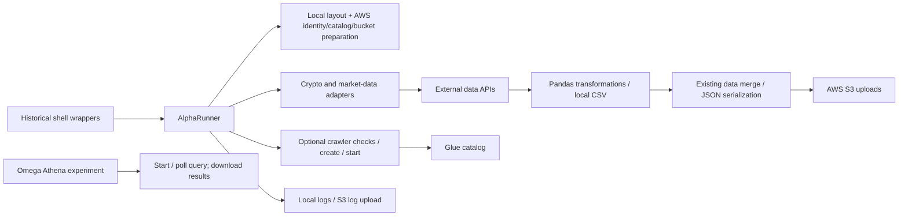

# Crypto Trader ingestion architecture

This repository implements headless data-ingestion and analytics experiments. Its learning-project name and historical plans do not establish live trading, a frontend or an accepted strategy.

## Lifecycle and side effects

[AlphaRunner](../alpha/mt_alpha_runner.py) parses arguments and initializes paths/logging in its constructor. Its `main` prepares local setup, catalog and bucket before selecting normal or minute ingestion, then optionally runs Glue and uploads logs. [Setup](../alpha/setup.py) includes an AWS current-user lookup and local directory creation. A constructor or import is not established as safe inspection.

The [main shell wrapper](../runner.sh) changes into alpha and activates an old named environment. [alpha_runner.sh](../alpha/alpha_runner.sh) selects ingestion, focus-symbol mode and crawler execution. Crawler selection controls only that stage; it is not a global dry-run switch.

## Persistence and cloud operations

[SaveS3](../alpha/savetos3.py) creates AWS clients, fetches existing data, transforms/merges tabular data and uploads serialized output. [Bucket preparation](../alpha/s3maintenance.py), [catalog preparation](../alpha/awscatalogcreate.py), [database validation](../alpha/validatedatabase.py), [crawler operations](../alpha/gluemaintenance.py) and [log upload](../alpha/logtos3.py) are operational boundaries. Their declarations do not prove permissions, correct paths, idempotence, transactional persistence or successful cloud integration.

## Adapters and experiments

Alpha contains cryptocurrency history/pricing/social adapters and other market-data integrations. Source includes literal credential configuration and historical path assumptions; those values are excluded from reports, fixtures and canvas payloads.

[The Athena experiment](../omega/athena_test.py) contains top-level query and result-download calls. Other omega files are regression experiments, not an inert test suite. SQL/query strings and datasets are outside this documentation inspection. The five non-parsing inactive prototypes remain documented historical gaps rather than a repaired or runnable package.

## Verification boundary

The checker parses source as text and reports syntax metadata only. The 25 active alpha and three omega scripts parse; parsing neither imports dependencies nor contacts an account. Static links and Mermaid source are checked for document structure, with MDX rendering unverified. [Developer guidance](./developer-guide.mdx) separates safe inspection from future isolated behavior qualification.
