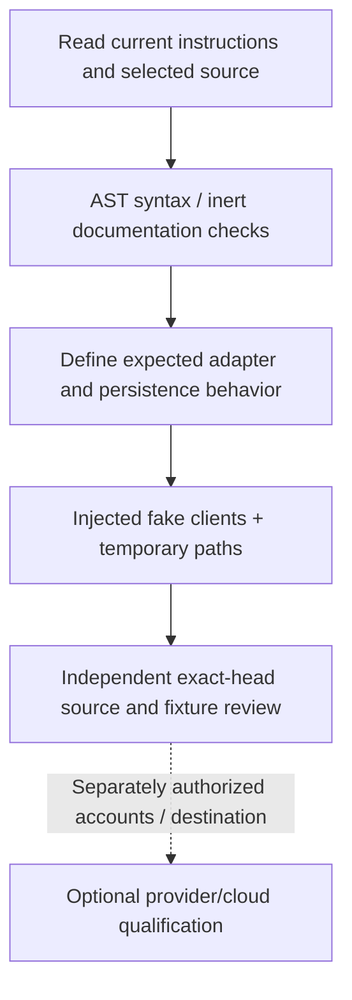

# Working with Crypto Trader

Preserve current owners' source, data and environment changes. Start with the selected runner or adapter and its adjacent persistence/cloud boundaries; never treat a filename containing `test` as an inert suite.



## Safe inspection

With Python 3, from the root:

```bash
python3 scripts/check_docs.py
```

The checker reads selected Python files without importing them. It parses 25 top-level alpha scripts and three omega scripts, compares the file inventory, reports five documented inactive syntax failures using metadata only, and validates local documentation destinations and labelled/balanced fences. No source lines, credential literals or dataset content are printed. CI runs this dependency-free static scope.

## Source routing

| Task | Adjacent source |
| --- | --- |
| Run selection | [AlphaRunner](../alpha/mt_alpha_runner.py), [shell wrapper](../alpha/alpha_runner.sh) |
| Paths and prerequisite setup | [Setup](../alpha/setup.py), [catalog](../alpha/awscatalogcreate.py), [bucket](../alpha/s3maintenance.py) |
| Serialization and object lifecycle | [SaveS3](../alpha/savetos3.py), [log upload](../alpha/logtos3.py) |
| Crawler lifecycle | [Glue](../alpha/gluemaintenance.py), [database validation](../alpha/validatedatabase.py) |
| Query experiment | [Athena](../omega/athena_test.py); inspect top-level calls before any import |

## Before behavior qualification

The historical [requirements export](../requirements.txt) and Anaconda activation path have not been reproduced. There is no verified modern minimal dependency/packaging contract or automated inert runtime suite established by this change. Do not install the complete historical environment just to inspect documentation.

For a future behavior change, inject fake provider and AWS clients, inert credentials and disposable paths before constructing a runner or persistence helper. Verify stage selection, serialization/merge behavior, failure handling and upload/crawler call counts using synthetic input. Do not use real local data or another owner's cloud destination. Disabling only crawler execution leaves other side effects enabled.

Live account provisioning, provider compatibility, data correctness, analytics acceptance and deployment require their own scope and evidence. Historical administrator-account guidance is not a setup requirement for this audit. Keep source credential configuration and raw data out of hosted context.

## Known boundaries

Five scripts under `alpha/inactives/` do not parse: `newtradepair.py`, `haspricing.py`, `forloopfetchprice.py`, `newfetchprice.py` and `price_all_permutation.py`. They remain historical prototypes. A syntax pass for active scripts does not establish successful imports or executions. No trading/account/cloud/query/notebook/data operation, MDX render or deployment is qualified by the documentation workflow.
